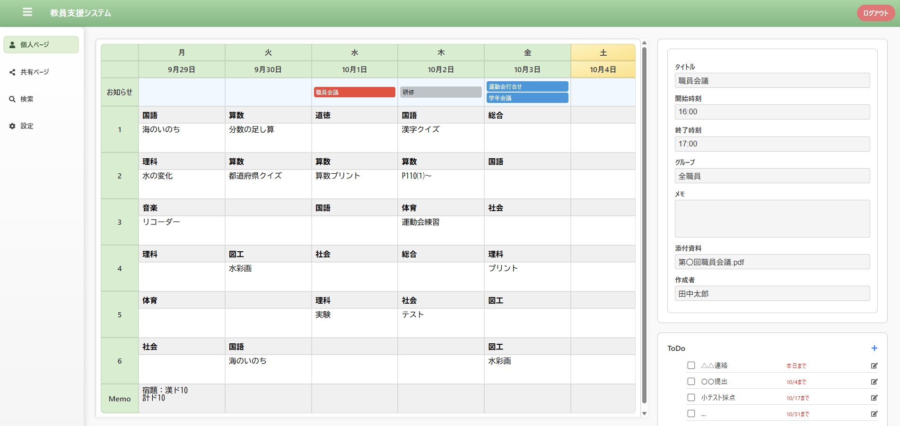
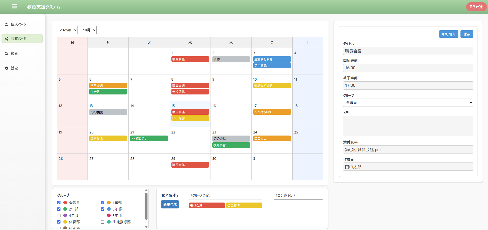
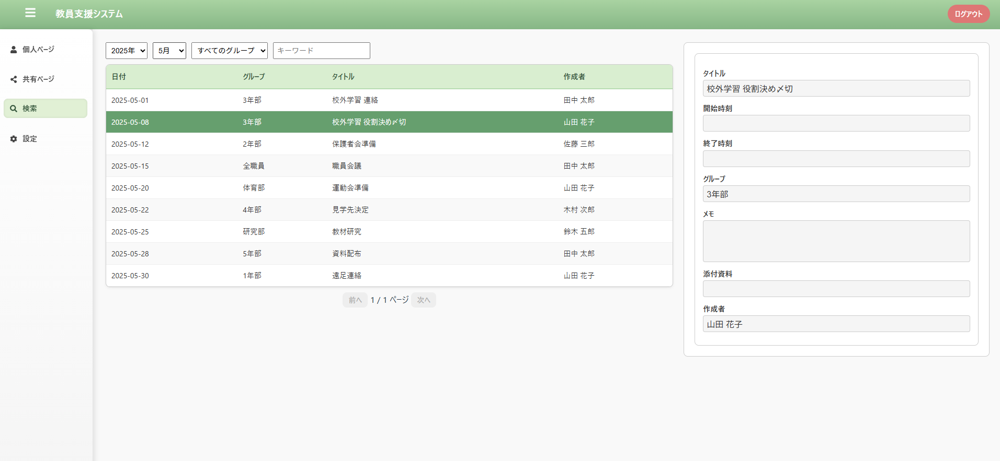
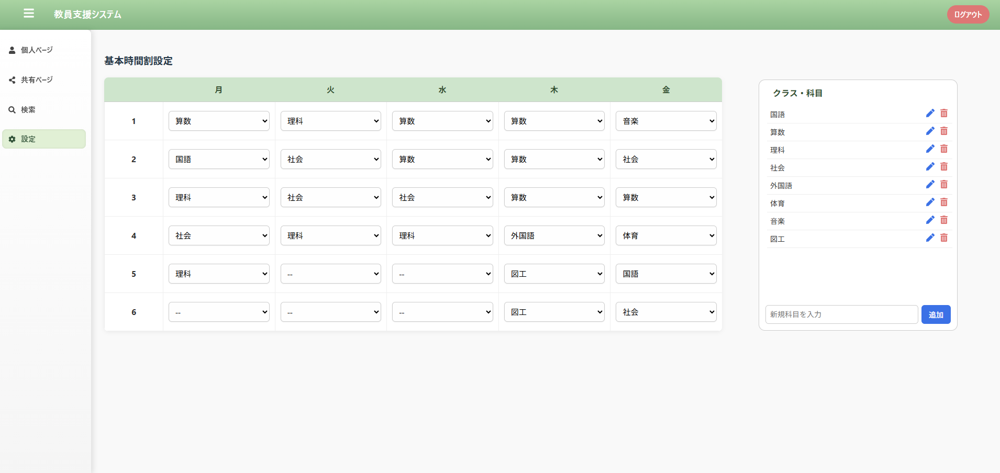

# 教員支援システム - デモアプリ（フロントエンドのみ）
本アプリは、教員の業務を支援するWebベースのスケジュール管理システムのデモアプリです。 
React(Vite)を用いてフロントエンドの構築を行っており、バックエンドは未実装です。 
[デモサイトを開く](https://tak950103.github.io/teacher-demo-app/)
(ログインID、PW必要なし）

## 主な機能

### 個人ページ `/personal`

- 時間割形式の予定表（Timetable）を表示
  - お知らせ欄(`announcement-row`)は行事をラベル形式で表示。クリックで詳細パネルに表示。
  - 科目(`subject-cell`)と授業内容メモ(`memo-cell`)はinputとtextareaでそれぞれ編集可能。
- 詳細パネル（DetailPanel）の表示
  - お知らせ欄表示の予定やメモについて、詳細を表示。
  - タイトル、開始・終了時刻、グループ、メモ、添付資料、作成者の表示。
  - このページでは編集不可。
- ToDoリスト（TodoList）の表示
  - 内容、締切（カレンダーピッカー）、完了かどうか（チェックボックス）を表示。
  - 各ボタンから、モーダルが表示され、新規追加や編集が可能。
  
### 共有ページ `/shared`

- 月別カレンダー（CalendarView）の表示
  - 年月選択により、指定された月のカレンダーを表示
  - カレンダー内に予定ラベルを配置。クリックで詳細パネルへ。
  - 日ごとの予定も管理。日付のセルをクリックすると、その日の詳細を表示。
- 表示グループ設定（GroupSelector）
  - `label`と`color`を指定して表示グループが選択可能。
  - 表示グループの切り替えにより、CalendarViewに表示されるラベルの絞り込みが可能。
- 日ごとの予定表示パネル（EventList）
  - 3列表示＜日付、グループの予定、自分の予定＞
  - ラベル表示
- 詳細パネル（DetailPanel）の表示
  - 新規作成・編集が可能。

### 検索ページ `/search`

- 年・月・キーワードなどで過去の予定を絞り込み検索
- 表 + 詳細パネルの構成

### 設定ページ `/settings`

- 時間割の基本パターン編集
  - 科目マスタ内の項目をプルダウンリストから選択
- 科目マスタの追加・編集・削除が可能

---

## 使用技術

| 技術         | バージョン・詳細          |
|--------------|-------------------------|
| Vite         | React + JSX             |
| React        | Functional Components + Hooks |
| CSS          | モジュールごとの分離（レスポンシブ対応）|
| react-router-dom | ページ遷移管理        |

---

## デザイン方針

- 小中高の現場を想定
- 編集しやすいUI（テキスト入力・選択・テーブル構造）

